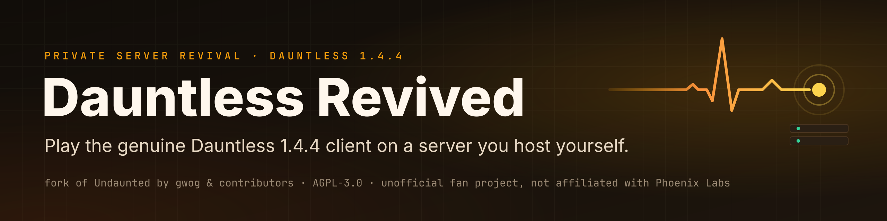

<a href="README.md">🇬🇧 In English</a>

  

  
  
  
  

# Dauntless Revived

**Dauntless Revived herättää Dauntless-pelin henkiin omalla palvelimella.** Dauntless oli Phoenix
Labsin ilmainen verkkopeli, jossa pelaajat metsästivät yhdessä suuria hirviöitä. Pelin viralliset
palvelimet (tietokoneet, jotka pyörittivät peliä verkossa) suljettiin **30.5.2025**. Sen jälkeen
peliä ei ole voinut pelata.

Tämän projektin avulla alkuperäistä **Dauntless 1.4.4** -versiota (lokakuulta 2020) voi taas pelata.
Peli vain ottaa yhteyttä palvelimeen, jonka pystytät itse. Projekti on jatkoa
**[Undaunted](https://github.com/SyST3MDeV/Undaunted)-projektille**, jonka tekivät gwog (Gregory
Morford) ja muut tekijät. He rakensivat tärkeimmät osat. Yksi niistä on DLL-tiedosto (pieni
ohjelmakirjasto, jonka peli lataa käynnistyessään). Sen avulla pelistä saadaan pelipalvelin. Lisäksi
he tekivät palvelinohjelmat ja käynnistysohjelman. Tämä versio lisää niihin korjauksia,
kavereille asennuspaketin ja ohjeet.

Tässä koodivarastossa (GitHubissa olevassa projektin kansiossa) tai ohjesivustolla ei jaeta
pelitiedostoja. Tarvitset oman kopion Dauntless 1.4.4 -pelistä.

> **Tämä ei ole julkinen palvelin.** Sitä pyöritetään muutamalle kaverille. Kuka tahansa voi
> pystyttää oman palvelimensa tämän koodin avulla.

## Lyhyet vastaukset

### Voiko Dauntlessia vielä pelata?
Virallisilla palvelimilla ei: Phoenix Labs sulki ne 30.5.2025. Jos sinulla on 1.4.4-version kopio,
voit pelata sitä omalla palvelimellasi tämän projektin avulla.

### Onko Dauntlessille yksityispalvelinta?
On. Tämä projekti on sellainen: itse ylläpidettävä palvelin 1.4.4-versiolle, Undauntedin pohjalta.
Se ei ole avoin kaikille, joten pystytät oman ja kutsut kaverisi.

### Pääsenkö pelaamaan teidän palvelimellanne?
Et. Julkista palvelinta ei ole. [Asennusohjeet](https://mixutin.github.io/dauntless-revived/fi/setup/)
kertovat, miten pystytät oman.

### Saako täältä pelin?
Ei. Tässä koodivarastossa tai ohjesivustolla ei ole pelitiedostoja eikä linkkejä niihin.

### Mikä pelin versio toimii?
Vain **1.4.4**. Viimeinen versio 2.1.1 ei toimi, koska Undauntedin DLL-tiedosto on tehty juuri
1.4.4-version ohjelmatiedostoa varten.

### Tarvitsenko Epic Games -tilin?
Et. Jokainen pelaaja kirjautuu omalla henkilökohtaisella avaimella (se toimii kuin salasana). Avaimen
antaa oma palvelimesi.

### Onko tämä virallinen?
Ei. Tämä on epävirallinen fanien tekemä projekti, josta ei makseta eikä tienata mitään. Sillä ei ole
mitään yhteyttä Phoenix Labsiin eikä Epic Gamesiin.

Lisää vastauksia on sivulla
[Usein kysyttyjä kysymyksiä](https://mixutin.github.io/dauntless-revived/fi/faq.html).

## Tilanne

Syyskuu 2026. Kaikkea alla olevaa on kokeillut yksi pelaaja palvelinkoneella.

| Ominaisuus | Tila | Lisätietoa |
|---|---|---|
| Kirjautuminen omalla avaimella | Toimii | Epic-tiliä ei tarvita |
| Opetusjakso | Toimii | Pelipalvelin käynnistyy, kun sitä tarvitaan |
| Ramsgate (pelin kaupunki, jossa pelaajat tapaavat) | Toimii | Ramsgaten palvelin on koko ajan päällä |
| Training Dojo (harjoitussali) | Toimii | Käynnistyy, kun joku menee sinne |
| Metsästykset | Toimii (yksin) | Pelattu: Lesser Boreus -hirviön metsästys ja takaa-ajo (pursuit) |
| Varusteiden valmistus | Toimii | |
| Tavarat, varusteet ja tehtävät | Toimii (yksin) | Tallentuvat tietokantaan ja säilyvät, vaikka peli ja palvelin käynnistetään uudelleen |
| Varmuuskopiot | Toimii meidän palvelinkoneellamme | Joka tunti sekä aina palvelimen käynnistyessä ja sammuessa. Palautus on kokeiltu. Varmuuskopio-ohjelmat eivät ole vielä tässä koodivarastossa ([ohje oman varmuuskopion tekemiseen](https://mixutin.github.io/dauntless-revived/fi/setup/admin.html#back-up-the-database)). |
| Kavereiden asennuspaketti | Valmis | Tarkistaa tiedostot ja käynnistää pelin. Odottaa Tailscalea ja kutsukoodeja. |
| Pelaajan taso, mestaruus ja Hunt Pass (palkintojärjestelmä) | Toimii (yksin), oletuksena päällä | Alkavat nollasta ja tallentuvat; jokaisella tilillä on Elite Hunt Pass. Kokeiltu pelissä testitilillä, myös palvelimen uudelleenkäynnistyksen yli. `PROGRESSION_MODE=stub` palauttaa alkuperäisen kiinteän tason 50 ([päivitysohjeet](https://mixutin.github.io/dauntless-revived/fi/setup/upgrading.html)) |
| Pelaaminen kavereiden kanssa internetin yli | Ei vielä (M1) | Suunnitelma: Tailscale (ohjelma, joka yhdistää kavereiden koneet yksityiseen verkkoon) |
| Pelaajaryhmät ja kaverilista | Ei vielä | |
| Bounty-tehtävät (lisätehtävät, joista saa palkintoja) | Ei vielä | |
| Tekstichat | Ei vielä | Suunniteltu: pieni oma viestipalvelin (XMPP) |
| Useampi varustesarja | Ei vielä | |

Tarkka tehtävälista on tiedostossa [ROADMAP.md](ROADMAP.md) (englanniksi). Lyhyempi selitys suomeksi on
ohjesivuston sivulla [Tiekartta](https://mixutin.github.io/dauntless-revived/fi/roadmap.html).

## Tärkeimmät linkit

| Linkki | Mitä sieltä löytyy |
|---|---|
| [Ohjeet suomeksi](https://mixutin.github.io/dauntless-revived/fi/) | Projektin ohjesivut suomeksi |
| [Ohjesivusto englanniksi](https://mixutin.github.io/dauntless-revived/) | Samat ohjesivut englanniksi (in English) |
| [Asennusohjeet](https://mixutin.github.io/dauntless-revived/fi/setup/) | Oman palvelimen pystytys, kaverina liittyminen, palvelin ryhmälle ja ongelmien ratkaisu |
| [Kavereiden asennuspaketti](friend-kit/) | Kertaluonteinen asennus ja pelin käynnistin kutsutuille pelaajille ([ohje](https://mixutin.github.io/dauntless-revived/fi/setup/friends.html)) |
| [Tehtävälista](ROADMAP.md) | Välitavoitteet M0–M4 ja mitä on jo tehty |
| [Usein kysytyt kysymykset](https://mixutin.github.io/dauntless-revived/fi/faq.html) | Lyhyet vastaukset yleisiin kysymyksiin |
| [Keskustelupalsta](https://github.com/mixutin/dauntless-revived/discussions) | Kysymykset, ideat ja omat asennukset |

## Miten tämä toimii

1. Jokainen pelaaja käynnistää alkuperäisen, muuttamattoman 1.4.4-pelin. Pelin kansiossa on kaksi Undauntedin DLL-tiedostoa, jotka ohjaavat pelin yhteydet omalle palvelimellesi.
2. **Metagame** on taustapalvelin eli ohjelma, jonka kanssa peli keskustelee taustalla (TypeScript, Express ja SQLite-tietokanta, portti 61000; portti on kuin oven numero verkossa). Se hoitaa tilit, hahmot, tavarat, varusteet ja pelien järjestämisen (matchmaking).
3. **Deploy server** (portti 61001, vain palvelinkoneella) käynnistää pelipalvelimia tarpeen mukaan. Ne ovat saman pelin kopioita, jotka DLL-tiedosto muuttaa palvelimiksi.
4. Pelipalvelimet (UDP-portit 8770–8777) pyörittävät Ramsgatea, metsästyksiä ja harjoitussalia. Kaverit on tarkoitus tuoda mukaan Tailscalen kautta.

## Mitä projektissa on

| Kansio | Mikä se on |
|---|---|
| `UndauntedMetagame/` | Taustapalvelin, jonka kanssa peli keskustelee: tilit, hahmot, tavarat, varusteet, eteneminen ja pelien järjestäminen |
| `UndauntedDeployServer/` | Käynnistää ja valvoo pelipalvelimia (Ramsgate, metsästykset, harjoitussali) |
| `UndauntedInternalServer/` | DLL-tiedosto, jonka avulla peli toimii pelipalvelimena ja joka ohjaa pelaajat omalle taustapalvelimelle |
| `UndauntedLauncher/` | Alkuperäisen Undaunted-projektin käynnistysohjelma |
| `friend-kit/` | Asennus- ja käynnistysohjelmat kavereiden koneille |
| `tools/` | `make-friend-kit.ps1` kokoaa kavereiden asennuspaketin; `sync-roadmap.js` kopioi tehtävälistan ohjesivustolle |
| `docs/` | Ohjesivusto (GitHub Pages) |
| `ROADMAP.md` | Suunnitelma ja tehtävälista |

## Muutokset alkuperäiseen Undauntediin

- Metagame ja deploy server kuuntelevat oletuksena vain omaa konetta (`BIND_HOST`). Alkuperäinen
  versio kuunteli kaikkia verkkoja, eikä deploy serverissä ole salasanaa tai muuta tunnistusta.
- Jos palvelin ei saa käyttöönsä porttia, se kertoo virheestä selvästi. Alkuperäinen versio ilmoitti
  onnistuneensa ja sulkeutui hiljaa.
- Jokainen metagamen saama pyyntö kirjataan lokiin (tapahtumaluetteloon). Pelipalvelimien pyynnöt
  on merkitty erikseen.
- Harjoitussali käynnistyy vasta, kun joku menee sinne, eikä heti alussa (`ENABLE_DOJO=1` palauttaa
  vanhan toiminnan).
- Kirjautumistunnisteet poistetaan lokista. Valinnainen tallennus (`LOG_BODIES=1`) kirjaa, mitä peli
  lähettää niihin tallennuksiin, jotka eivät vielä toimi. Kustakin pyynnöstä tallennetaan enintään 8 kt, ja
  tunnisteet poistetaan.
- **Oikea eteneminen oletuksena.** Alkuperäinen versio vastasi etenemistä koskeviin kyselyihin
  kiinteällä mallilla (jokainen tili tasolla 50, Hunt Passissa ei mitään lunastettavaa ja Elite-rata
  lukittuna) eikä tallentanut mitään. Meidän metagamemme tallentaa Slayer-tason, mestaruuden
  (mastery), Hunt Passin, oikeudet (Elite-passi kaikille), varustesarjojen paikat, odotusajat ja
  palkkiotehtävät jokaiselle tilille erikseen. `PROGRESSION_MODE=stub` palauttaa alkuperäisen
  toiminnan. Päivitätkö palvelinta, jolla on jo pelaajia? Lue ensin
  [päivitysohjeet](https://mixutin.github.io/dauntless-revived/fi/setup/upgrading.html).
- **Kavereiden asennuspaketti** (`friend-kit/`, kootaan ohjelmalla `tools/make-friend-kit.ps1`).
  Se tarkistaa Undauntedin kaksi DLL-tiedostoa tarkistussummilla (tiedoston ”sormenjäljillä”),
  rekisteröi pelaajan ja ohjaa pelin chat-yhteyden palvelinkoneelle, jotta peli ei ota yhteyttä
  Epicin vanhaan chat-palvelimeen. Paketin mukana tulevat lisenssi, muiden tekijöiden
  tekijänoikeustiedot ja `SOURCE.txt`, joka kertoo tarkan koodiversion.
- **Ohjesivusto** kansiossa `docs/`, osoitteessa
  [mixutin.github.io/dauntless-revived](https://mixutin.github.io/dauntless-revived/):
  asennusohjeet, tutkimustulokset pelin taustapalveluista ja tehtävälista.

Varmuuskopiot eivät ole vielä mukana. Meidän palvelinkoneellamme tietokannasta (tiedostosta, johon
pelaajien tavarat tallentuvat) otetaan varmuuskopio joka tunti, ja jokainen kopio tarkistetaan
(tehtävälistan kohta 0.1). Nämä varmuuskopio-ohjelmat eivät kuitenkaan ole vielä tässä
koodivarastossa. Metagame ei itse ota varmuuskopioita. Jos pystytät oman palvelimen, huolehdi
varmuuskopioista itse. Ohje on sivulla
[Palvelin ryhmälle](https://mixutin.github.io/dauntless-revived/fi/setup/admin.html#back-up-the-database).

## Tietoturva

- Metagame ja deploy server kuuntelevat oletuksena vain osoitetta `127.0.0.1` eli omaa konetta.
- Deploy serverissä **ei ole tunnistusta**. Se on tehty niin tarkoituksella. Älä koskaan avaa sitä
  muiden koneiden käyttöön.
- Kaverit on tarkoitus yhdistää Tailscalen kautta, ei avoimen internetin yli.

Löysitkö tietoturva-aukon (virheen, jota joku voisi käyttää väärin)? Ilmoita siitä yksityisesti
[tästä linkistä](https://github.com/mixutin/dauntless-revived/security/advisories/new), älä
julkisessa keskustelussa. Lisätietoa on tiedostossa [SECURITY.md](SECURITY.md) (lopussa suomeksi).

## Osallistuminen

Ideat ja korjaukset ovat tervetulleita. Aloita isommat muutokset avaamalla keskustelu
[keskustelupalstalla](https://github.com/mixutin/dauntless-revived/discussions). Kokeile muutoksia
erillisellä testitilillä, älä omalla. Älä koskaan lisää projektiin avaimia, `.env`-tiedostoja tai
pelin tiedostoja. Tarkemmat ohjeet ovat tiedostoissa [CONTRIBUTING.md](CONTRIBUTING.md) ja
[CODE_OF_CONDUCT.md](CODE_OF_CONDUCT.md) (molemmissa suomenkielinen osio).

## Muut vastaavat projektit

- **[Undaunted](https://github.com/SyST3MDeV/Undaunted)**: alkuperäinen projekti, jonka pohjalta
  tämä on tehty.
- **[Mystic Paradox](https://github.com/pranav158/Mystic-Paradox)**: vie saman idean pelin
  1.12.0-versioon, jossa on myöhemmin julkaistua sisältöä. Emme ole kokeilleet sitä, eikä tässä
  projektissa ole sen koodia.

## Kiitokset

- **[Undaunted](https://github.com/SyST3MDeV/Undaunted)**: gwog (Gregory Morford) ja
  [muut tekijät](https://github.com/SyST3MDeV/Undaunted/graphs/contributors). He tekivät
  palvelintilan DLL-tiedoston, deploy serverin, metagamen ja käynnistysohjelman. Moninpeli
  Ramsgatessa ja metsästyksissä 1.4.4-versiolla on heidän saavutuksensa.
- **[MinHook](https://github.com/TsudaKageyu/minhook)**, tekijä Tsuda Kageyu (BSD 2-Clause
  -lisenssi): ohjelmakirjasto, jota palvelimen DLL-tiedosto käyttää.
- **[Dumper-7](https://github.com/Encryqed/Dumper-7)**, tekijät Encryqed ja muut: työkalu, jonka
  avulla DLL-tiedosto on rakennettu Unreal Engine -pelimoottoria varten.
- **Phoenix Labs**, joka teki Dauntlessin.

### Osallistujat

- **[Vvoidddd](https://github.com/Vvoidddd)**: korjaus pimeään ilmalaivaan ennen metsästystä
  (1.4.4:n automaattinen valotus), piilotetut konsoli-ikkunat metsästyspalvelimille ja projektin
  `.gitignore`-tiedosto ([#5](https://github.com/mixutin/dauntless-revived/pull/5)).

Kaikki osallistujat näkyvät [osallistujasivulla](https://github.com/mixutin/dauntless-revived/graphs/contributors).

Koko luettelo on ohjesivuston sivulla
[Kiitokset ja lisenssi](https://mixutin.github.io/dauntless-revived/fi/legal.html).

## Lisenssi

Tämä on **muokattu versio [Undaunted](https://github.com/SyST3MDeV/Undaunted)-projektista**, jonka
tekivät gwog (Gregory Morford) ja muut tekijät. Muutokset aloitettiin **21.9.2026**. Jokainen muutos
näkyy tämän projektin muutoshistoriassa, ja suunnitellut muutokset ovat tiedostossa
[ROADMAP.md](ROADMAP.md).

Lisenssi on GNU Affero General Public License v3.0 only, ks. [LICENSE.txt](LICENSE.txt). Lisenssi on
käyttöehdot, jotka kertovat, miten koodia saa käyttää. Tärkein sääntö: jos pyörität muokattua
versiota muille ihmisille, sinun pitää tarjota heille sen lähdekoodi (ohjelman ihmisen luettava
muoto).

Tällä projektilla ei ole yhteyttä Phoenix Labsiin eikä Epic Gamesiin, eivätkä ne ole hyväksyneet
sitä. ”Dauntless” on omistajiensa tavaramerkki. Tässä projektissa tai sen ohjesivustolla ei jaeta
pelin tiedostoja.
